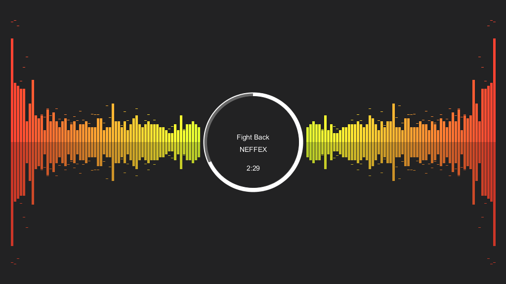

# Processing Music Visualizer
A music visualizer made in Processing 2 for a university project.

## Requirements
- Processing Development Environment (PDE)
- Minim audio library

If you are using Processing 2.0 you already have Minim.
In Processing 3.0 you can install Minim from the Contribution Manager.

## Instructions
- clone/download this project
- copy your music file inside the `MusicVisualizer/data` folder
- rename your file into `song.mp3`
- open the sketch with PDE and run it

## Controls
- LeftClick pauses the song
- RightClick restart the song
- MouseX-position determines the color of the bars
